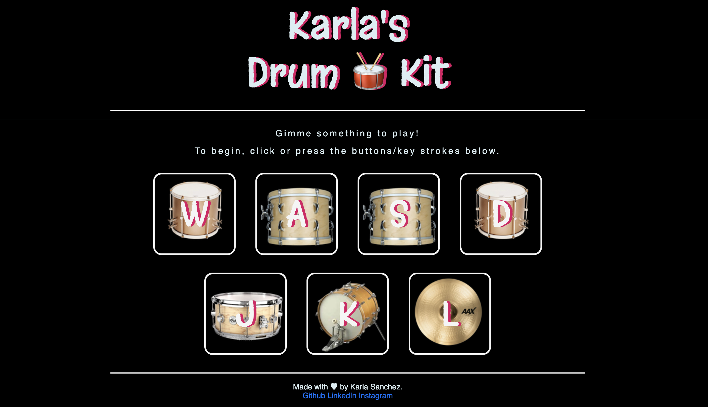

<!-- PROJECT SHIELDS -->
<!--
*** I'm using markdown "reference style" links for readability.
*** Reference links are enclosed in brackets [ ] instead of parentheses ( ).
*** See the bottom of this document for the declaration of the reference variables
*** for contributors-url, forks-url, etc. This is an optional, concise syntax you may use.
*** https://www.markdownguide.org/basic-syntax/#reference-style-links
-->

<!-- PROJECT LOGO -->
 
<header align="center">
  <h1 align="center">Drum Kit Simulator</h1>

  

      
    <a href="https://github.com/karlasanc/drum-kit"><strong>Explore the docs »</strong></a>
     
     
    <a href="https://drumkit-karla.netlify.app/">View Demo</a>
  

</header>

<!-- TABLE OF CONTENTS -->

  
Table of Contents

  <ol>
    <li>
      <a href="#about-the-project">About The Project</a>
      <ul>
        <li><a href="#built-with">Built With</a></li>
      </ul>
    </li>
    <li><a href="#license">License</a></li>
    <li><a href="#acknowledgments">Acknowledgments</a></li>
    <li><a href="#contact">Contact</a></li>
  </ol>

<!-- ABOUT THE PROJECT -->
## About The Project
This is a simple front-end web application that simulates the sounds of a drum kit. This project was a great way to practice and learn about the Document Object Model (DOM) manipulation and JavaScript event listeners. 

The application listens for user input from clicking a button or pressing a keystroke. Once the user triggers the event, the application will play sound and animation for that specific key/click.

### Built With
* HTML
* CSS
* JavaScript

* The project demo is hosted on Netlify.

### Requirements
* Users should be able to click a button and play sound.
* Users should be able to  press a key on their keyboard to play a sound.
* Each button should play a different sound.
* Each button should have a corresponding image to the sound.

<!-- LICENSE -->
## License
Distributed under the MIT License. See `LICENSE.txt` for more information.

<!-- ACKNOWLEDGMENTS -->
## Acknowledgments
* [Google Fonts](https://fonts.google.com/)

<!-- CONTACT -->
## Contact
Karla Sanchez - [My Portfolio](karlasanchez.us) - karlaonrails@gmail.com

(<a href="#readme-top">back to top</a>)

